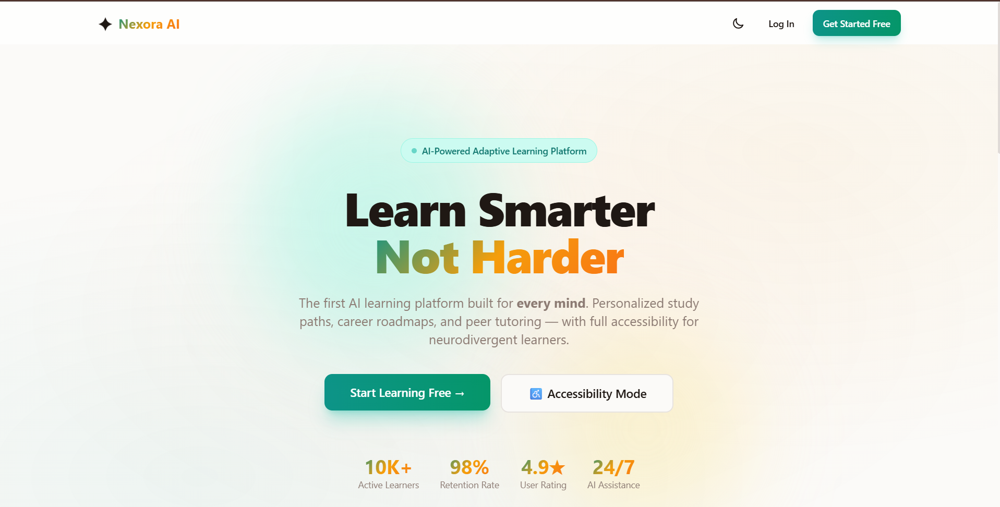

# Nexora AI

> **Project status:** Active development. Core remediation is complete; deployment and production verification are still in progress.

AI-powered adaptive learning infrastructure designed for students with
ADHD, autism and dyslexia.

## Problem

Most learning platforms deliver the same material in the same format,
even though neurodivergent learners may require different presentation,
pacing and interaction styles.

## Solution

Nexora allows educators to upload learning material and reconstructs it
into accessibility-aware learning experiences.

## Key Features

- ADHD-focused content restructuring
- Dyslexia-friendly presentation
- Autism-aware learning flows
- Educator and student dashboards
- Real-time communication
- Accessibility preferences
- AI-assisted material transformation
- Secure authentication

## Screenshots

[


## Tech Stack

- **Frontend:** React 19, TypeScript, Vite, Tailwind CSS, ShadCN UI, Zustand, React Query
- **Backend:** Node.js, Express, TypeScript, Socket.io
- **Database:** MongoDB with Mongoose
- **Authentication:** JWT with HttpOnly cookies
- **AI:** Groq-powered content transformation
- **Deployment:** Vercel and Render

## Local Development

```bash
npm run install:all
npm run dev
```

The frontend runs on `http://localhost:5173` and the backend runs on `http://localhost:5000`.

MongoDB must be running locally or configured through `MONGODB_URI`.

## Testing

- Frontend: 8 tests
- Backend: 26 tests
- End-to-end: 11 tests
- Total: 45/45 passing

## Security Improvements

- HttpOnly cookie authentication
- Removed public privileged seed credentials
- Input validation
- Environment-based configuration

## AI-Assisted Development

Explain which AI agents were used and that generated changes were reviewed,
tested and accepted by the team.

## Current Status

Beta preparation; production deployment gates remain.

## Known Limitations

- Production deployment and third-party service configuration still require final verification.
- Real email delivery, media upload, and AI-provider behaviour depend on valid production credentials.
- Cross-browser, mobile-device, and accessibility testing is still ongoing.
- AI-generated learning content should be reviewed by educators before high-stakes use.

## License

## My Contribution

- Product direction and feature planning
- Accessibility-focused workflow design
- Deployment coordination
- QA, audit review, and remediation tracking
- Security and release-readiness improvements

## Team

Nexora AI was developed as a team project for Hack4Soc 3.0.

Team member names and individual responsibilities will be documented here after final confirmation.

## Current Status

The core application has completed a major remediation pass. Local builds and automated tests are passing. Remaining work includes deployed-environment verification, production service configuration, and final browser/device testing.
